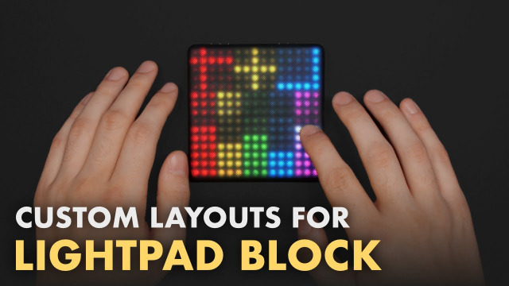

# Dynamic Controls 2

**Dynamic Controls** is a free app for ROLI Dashboard. It turns your ROLI Lightpad Block into a highly customisable MIDI control surface.

Design your own control layout using Buttons, Faders and XY Pads!

*Developed by Anthony Alfimov and Andreas Swoboda.*

---

## App Editions

#### Dynamic Controls
Create up to 16 Buttons, Notes, Faders or XY Pads.

#### Dynamic Controls LE (Light Edition)
Create up to 25 Buttons, Notes or Faders with a limited feature set.

---

## Installation

1. Make sure you have the latest version of [ROLI Dashboard](https://roli.com/products/software/blocks-dashboard) installed. Use ROLI Dashboard to update your Lightpad to the latest firmware.

2. Download the Dynamic Controls installer for your operating system from [swonic.com](https://swonic.com/dynamic-controls/) and run it.

3. Launch ROLI Dashboard and connect your Lightpad to the computer (USB connection is recommended). Select "Dynamic Controls" or "Dynamic Controls LE" to load it onto your Lightpad Block. Press the "Edit" button and select the "Blank" mode to start creating your own MIDI controller!

---

## Support

Dynamic Controls is a non-commercial project.

Available as a free download at [swonic.com](https://swonic.com/dynamic-controls/)

Need any help? Send us a message at dynamic.controls@swonic.com
